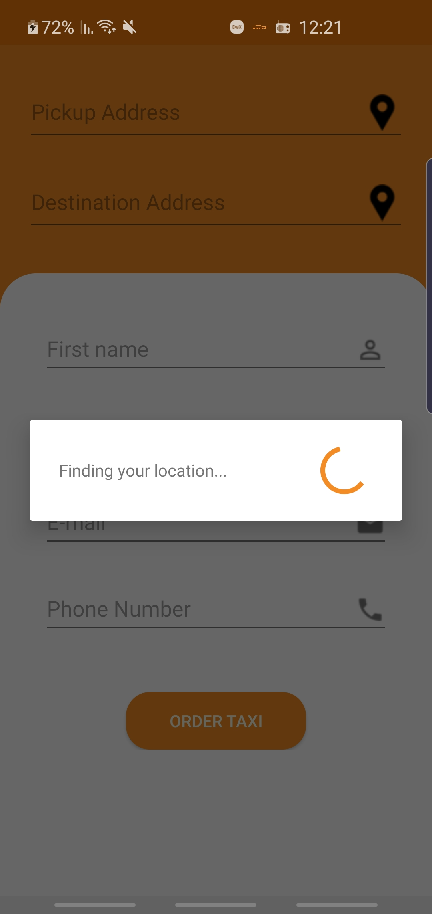

# Android RideTaxi-driver app
In this application we have exercised how to build an Android app using MVC pattern, Firebase and Google Location api.
We used few abstractions method and design pattern.

The purpose of the application is to connect between a passenger and a taxi driver.

     

 

 

